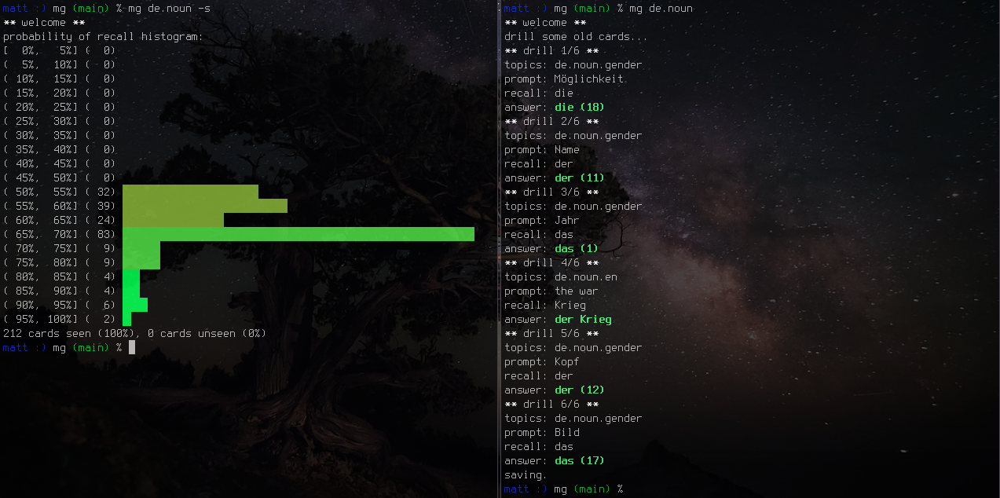

# memograph

A utility for drilling flashcards based on an online Bayesian
spaced-repetition memory model
(the algorithm of [ebisu](https://github.com/fasiha/ebisu), but my own
[independent implementation](mg/webisu/)).

For example decks and my memory models, see
[memograph-decks](https://github.com/matomatical/memograph-decks) repo.

For a tutorial on using this app and creating your own decks,
see [tutorial](tutorial/).



## Installation

* Install Python 3.7 or higher.
* Clone this repository.
* There are no mandatory Python dependencies right now.
* If using TTS, install [`espeak`](https://github.com/espeak-ng/espeak-ng/).
* Create some flashcard decks (.mg directories).
  See also the [tutorial](tutorial/) or my repository of decks
  [memograph-decks](https://github.com/matomatical/memograph-decks))
  for examples.

Should work on macOS, Android (Termux), Arch Linux, and probably elsewhere.

## Usage

Call the program with `python3 -m mg <options>` (or use an alias `mg`).

(Apologies to `mg(1)`, the 'emacs-like text editor' on unix, but I like the
name too much, and I don't see why you deserve it more than I.)

From there, see the help:

```
usage: mg [-h] [-v]
          {drill,learn,status,history,commit,sync,recompute,checkup} ...

memograph: memorise a knowledge graph with Bayesian scheduling

optional arguments:
  -h, --help            show this help message and exit
  -v, --version         show program's version number and exit

subcommands:
  {drill,learn,status,history,commit,sync,recompute,checkup}
                        run subcommand --help for detailed usage
    drill               drill existing cards this session
    learn               introduce new cards for this session
    status              summarise model predictions
    history             coming soon...
    commit              coming soon...
    sync                coming soon...
    recompute           coming soon...
    checkup             coming soon...
```

### Making an alias

I put the folder containing mg on my Python path and created an alias by
putting the following lines into my `.zshrc`:

```
export PYTHONPATH="/path/to/repo/memograph:$PYTHONPATH"
alias mg="python3 -m mg"
```

### Deck format

You can create your own flashcard decks by creating a directory in the
`.mg` format.

From the help:

```
knowledge graph specification format: Knowledge graph edges (a.k.a. 'cards')
are taken from .mg decks in the current directory. Each .mg deck is a script
defining a generator function `graph()` yielding (node 1, node 2) pairs or
(node 1, node 2, topic) triples. Nodes can be primitives (str, int, float,
bool) or of type `mg.graph.Node`.
```

For more guidance and deck options, see the [tutorial](tutorial/),
or the example repository of decks
[memograph-decks](https://github.com/matomatical/memograph-decks).


## The Future

### TODO list

* Improve keyboard controls when an option is needed
* Add multimedia extensions:
  * Sound effects
  * Mathematics equations (in the terminal?!)
  * Support image-based flashcards.
* Find a nice way to allow custom assessment (autocomplete?)

#### Done:

* There is a noticable delay when printing using `prompt_toolkit`. Since my
  use case is very simple, it should be possible to replace with pure python
  using readline and ANSI codes.
  * Switch to standard readline for the input (forgo rprompt... for now!)
  * Switch to simpler, home-built formatted printing functionality
  * Reimplement right-aligned printing using '\r' and terminal width
* There is a noticable delay to import ebisu, which pulls numpy.
  Reimplement the Bayesian scheduling algorithm in pure Python.
* Add multimedia extensions:
  * Text-to-speech e.g. for language cards
* Add a [tutorial](tutorial/).


### Longer-term ideas

* Perhaps separate `ptdb` (the plain-text database) into another project.
* Perhaps separate `topk` (the efficient heap-based top-k algorithm) into
  another project.
* Perhaps switch to a domain-specific language for specifying the graphs.
* It might be worth pulling in numpy for very large decks due to savings from
  vectorisation. Reimplement ebisu for opt-in use with more vectorisation?

#### Towards modelling memory of the latent structure of decks

In [Step 1 of the Tutorial](tutorial/), we discuss the use of latent
deck structure in compressing deck specification through Python's
expressive power.
When such latent structure exists, it's another question as to whether
drilling a large number of independent flashcards is appropriate.
I actually think that in this case we want to be drilling *the components
of the latent structure itself*.

Take German numbers again. There are 10 independent concepts to learn
when learning the first 10 digits. But there are maybe only 30 or so
when learning the first 100.
(the numbers 0--19, the multiples of ten 20, 30, 40, ..., 90, and the
rules for combining the tens place and ones place into a final number
with 'und')
Furthermore, with the first 1,000,000 numbers, there are only a couple
more concepts to learn, yet there would be 1,000,000 independent
flashcards! There would never be enough time to drill each of these,
let along enough times to accurately estimate memory parameters for them.

Correspondingly, a flashcard-generating Python script which generates
cards for the first 1,000,000 German numbers will only be a couple of
times longer than our scripts from the tutorial for the first 10 numbers,
as long as the structure of the script follows the compositional
structure discussed above.

A key point here is that *the simplest program that generates the
deck probably mirrors the latent structure itself*.
One day, I'd like to see if it's possible, using some analysis akin to
automatic differentiation from deep learning toolkits, to introspect the
generating code (which may need to be written in a new DSL) and build
a memory model for the couple-of-dozen latent concepts rather than the
1,000,000 output tuples, and to perform inference on this model through
results on the concrete flashcards.

For example, you just got '77' right, and '186' right, so the model's
update would know that it's pointless to also ask you about '177',
'87', '76', etc., which do not use any different concepts from the
latent structure. The next prompt should be something that uses wholly
different concepts, such as '15', or '1,042'. And you don't need to ever
even see all of the numbers beyond '1,000' for the model to realise that
*you could translate them if you did*, because you have grasped the
latent structure.

The result might even be able to be pushed to practically unlimited
decks with a finite latent structure/generating program
(such as for sentence generation based on a context-free grammar).
